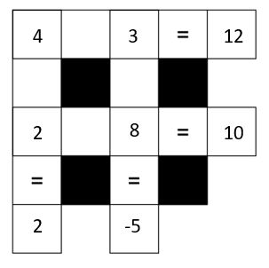

```{r, include=FALSE}
knitr::opts_chunk$set(warning = FALSE, message = FALSE)
```


# Instructions

## How do I hand in these problems for the January 14th?

Your complete Rmd file that you create for these practice problems AND the resulting pdf (i.e., the one you 'Knit to PDF' from your .Rmd file) must be uploaded into a Quercus assignment (link: [https://q.utoronto.ca/courses/206597/assignments/512542](https://q.utoronto.ca/courses/206597/assignments/512542)) by 11:59 a.m. ET, on Thursday, January 14th. Late problem sets are NOT accepted.


# Problem set grading

There are two parts to your problem set. One is largely R-based with short written answers and the other is more focussed on writing. We recommend you use a word processing software like Microsoft Word to check for grammar errors in your written work. Note: there can be issues copying from Word to R Markdown so it may be easier to write in this file first and then copy the text to Word. Then you can make any changes flagged in Word directly in this file.


# Part 1

## [Question 1]

Below is a 'math square puzzle'. The value for each row and column is shown after the equals signs, but the operations are missing. The possible operations are: addition, subtraction, multiplication and division.

For example, if a row said 2 blank 7 = 14, we could figure out that blank has to be multiplication (*).

### a) Write out the equations below and assign them to the appropriate names. The first rows has been completed as an example.


```{r}
# Row 1
r1 <- 4 * 3
  
# Row 2 (r2)

  
# Column 1 (c1)

  
# Column 2 (c2)


```

### b) Now, let's check you are right using what we've learned about logicals. Create a vector called `my_answers` in the order: rows 1 and 2 and then columns 1 and 2. Use the names you assigned, i.e. 'r1' and 'c2', not the numbers.

```{r}

```

### c) Create a numeric vector called `square_answers` with the values from after the equal signs from the math square above, i.e. 4, 6, 4, and 1, in that order.

```{r}

```


### d) Assign the name `check` to the result of this code: `square_answers == my_answers`. 

```{r}


# after saving the result of `square_answers == my_answers` to check, you can type "check" (no quotes) in the console and run it to see what it is
# alternatively, write check by itself on a new line after writing the code and run the whole chunk again
```

### e) Which of the following best describes what `check` is?

  (i) A single value counting how many correct rows and columns you calculated.
  (ii) A numeric vector of the differences between the math square answers and your answers (should be all 0s if you got them all right).
  (iii) A character vector of 'TRUE' and 'FALSE', 'TRUE' for each answer that matches and 'FALSE' for any that don't.
  (iv) A logical vector of TRUE and FALSE, TRUE for each answer that matches and FALSE for any that don't.
  (v) A single logical value TRUE or FALSE, TRUE if all the values match, FALSE if any of the values don't match.

Answer: <replace this with your answer>


### f) Use the `sum()` function (and the fact of coercion) to get a single numeric value for the number of rows and columns you got right. If you got everything right your result should be 4.

```{r}

```

\newpage

## [Question 2]

For this question we will work with data about the TV show Avatar: The Last Airbender. See the data description video on Quercus for more information and attributions:

### a) The name of the data set is `avatar.csv`. Load the data and save it under the name "avatar". 

```{r}
library(tidyverse)

avatar <- read_csv("avatar.csv")
# Tip: don't forget to put quote marks around the name of the dataset inside the function
```

### b) We have learned two functions this week that let us quickly get an idea of our data. Apply both of them to the avatar data.

```{r}
glimpse(avatar)
head(avatar)
```

### c) Based on your answer to b) answer the following:

How many observations does the `avatar` data frame include? *9,992 observations*

How many variables are measured for each observation? *10 variables*

How many rows and columns does the `avatar` data frame have? *9,992 rows and 10 columns*

\newpage

## [Question 3] 

In this question, you will consider another example of survivor bias. In 1987, a study published in the Journal of the American Veternary Medicine Association reported that cats that survived falls from higher floors in high-rise buildings suffered fewer injuries than cats who fell from lower floors (e.g. more than 6 stories vs less than 6 stories). While this finding seems counterintuitive, the authors suggested that this might be due to the cats relaxing and re-positioning themselves for a relatively safer landing after they reached maximum speed during their fall.  The data for this study was collected from cats who suffered falls and were brought to veternary clinics. 


### (a) Is this sample representative of all cats who suffer falls?


### (b) Do you expect that the average number of injuries for cats suffering falls calculated from this sample will be close to the true value?


\newpage

# Part 2

**Writing prompt**:  

Identify one of the course learning objectives (from the syllabus) that you are most excited about. Describe why this objective is especially interesting to you.

### Some general reminders 

- Try to not send more than 20 minutes on the prompt. 

- Aim for more than 200 words but less than 500 words. 

- Use full sentences.  

- Grammar is *not* the main focus of the assessment, but it is important that you communicate in a clear and professional manner. I.e., no slang or emojis should appear. 

- Be specific. A good principle when responding to a writing prompt in STA130 is to assume that your audience is not aware of the subject matter (or in this case has not read the syllabus). Therefore, in this case, you need to properly communicate what the objective is putting it in your own words (paraphrasing). You should not just copy the learning objective and put it in quotation marks.  